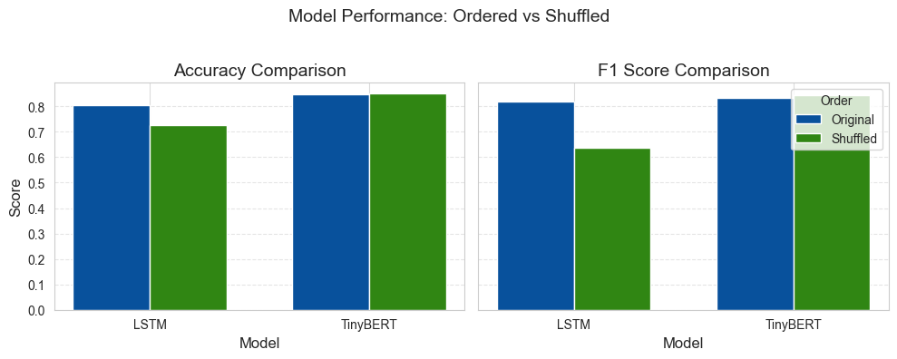

# Sentiment Order Study
**A research project  exploring the effect of training order on LSTM and Transformer models for sentiment analysis.**

To view experiment results in MLflow, go to: 
https://sentiment-order-lab.onrender.com  
*🛈 Note: Server may need ~1 min to start if inactive.*

## 🎯 Research Question
> Can LSTM and Transformer-based models produce significantly different sentiment predictions when the training data sequence is altered?

## Overview
This project compares two deep learning architectures — **LSTM** and **TinyBERT** — for sentiment classification on the **IMDb Movie Reviews** dataset. The focus is on testing whether **training data order** impacts the performance of each model.

Both models are trained twice:
1. **Original Order** (default dataset order)
2. **Shuffled Order** (randomized once before training)

The results are tracked using **MLflow**, with accuracy, F1 scores, and confusion matrices compared across both runs.

**Dataset**: [IMDb Movie Reviews](https://ai.stanford.edu/~amaas/data/sentiment/)


## Experiments
| Model     | Order     | Accuracy | F1 Score |
|-----------|-----------|----------|----------|
| LSTM      | Original  | 80.6%    | 0.82     |
| LSTM      | Shuffled  | 72.7%    | 0.63     |
| TinyBERT  | Original  | 84.6%    | 0.83     |
| TinyBERT  | Shuffled  | 85.0%    | 0.84     |

## Results Summary
**LSTM** shows a significant performance drop when order is removed, while **TinyBERT** remains stable, showcasing robustness due to its attention-based architecture.

> 📝 **Curious why LSTM performs worse on shuffled data while TinyBERT stays consistent?**  
> Explore [`sentiment_research_report.ipynb`](notebooks/sentiment_research_report.ipynb) — a detailed, step-by-step research log that covers training progress, model choices, and in-depth analysis of how data order affects learning.  



## Models
**LSTM**
* Embedding: Pre-trained Word2Vec (frozen)  
* Input: Lemmatized tokens  
* Architecture:
    * Embedding Layer (pre-trained Word2Vec, non-trainable)
    * LSTM Layer (64 units, with dropout and recurrent dropout)
    * Dense Output Layer (Sigmoid activation) 
* Output: Binary classification via Sigmoid  

**TinyBERT**
* Hugging Face pretrained checkpoint
* Input: Untouched raw sentences (tokenized via tokenizer)
* Architecture:
    * Pre-trained Transformer Encoder (TinyBERT General 4L 312D)
    * Dropout Layer
    * Classification Head (Dense Layer) 
* Output: Softmax binary classifier

## Tech Stack
* Python 3.10
* PyTorch
* Hugging Face Transformers
* TensorFlow
* Gensim (Word2Vec)
* Scikit-learn
* MLflow
* Docker + Render (for deployment)

## Repository Structure
```
sentiment-lstm-vs-transformer/  
│  
├── data/  
│   ├── IMDB_Dataset_large.csv  
│   ├── IMDB_Dataset_medium.csv  
│   └── IMDB_Dataset_small.csv  
│  
├── logs/  
│   ├── evaluation_results.log  
│   └── stats.log  
│  
├── mlruns/  
│  
├── models/  
│   ├── LSTM_sentiment_original.h5  
│   ├── LSTM_sentiment_shuffled.h5  
│   ├── TinyBERT_sentiment_original.pt  
│   └── TinyBERT_sentiment_shuffled.pt  
│  
├── notebooks/   
│   └── sentiment_research_report.ipynb  
│  
├── src/  
│   ├── models/  
│   │   ├── lstm.py  
│   │   └── tinybert.py
│   ├── config.py  
│   ├── main.py  
│   ├── preprocess.py  
│   └── stats.py  
│
├── .gitignore  
├── Dockerfile  
├── README.md  
└── requirements.txt  
 ```

## Getting Started
1. Clone the Repo  
```
git clone https://github.com/coralen/sentiment-order-study.git
cd sentiment-order-study
```
2. Install Dependencies  
```
pip install -r requirements.txt
```

3. Run Training
```
python main.py
```
**Total Training Time:** ~6.5 hours (for all 4 training runs on a standard CPU)


4. Launch MLflow UI Locally (Optional)
```
mlflow ui --backend-store-uri ./mlruns  
```
Open http://localhost:5000 to browse the experiment logs.
